# AutoUpdateProject

[](https://jitpack.io/#MZCretin/AutoUpdateProject)

### 想没想过做个自己的APP？

想没想过自己做个APP，自己做自己的产品，自己决定交互，自己制作ui，那么快来吧，我开源了段子乐APP的数据和接口，你完全可以自己diy一个你自己的产品了~，详情请查看：https://github.com/MZCretin/duanzile-open-api 欢迎star


### 系列

在工作之余，打算将一些常用的逻辑页面，模块，功能点做成library库，这样当有相似需求的时候，可以做到插拔式开发！现在系列中有以下内容

+ [App内部自动更新-AutoUpdateProject](https://github.com/MZCretin/AutoUpdateProject)
+ [选择城市-CitySelect](https://github.com/MZCretin/CitySelect)
+ [扫描二维码条形码控件-ScanCode](https://github.com/MZCretin/ScanCode)
+ [一键打开WebView件-WebViewUtils](https://github.com/MZCretin/WebViewUtils)
+ [简约动态权限申请库-FanPermission](https://github.com/MZCretin/FanPermission)
+ [弹出自定义支付密码输入框-InputPswDemo](https://github.com/MZCretin/InputPswDemo)

### 特点概述

+ **最大亮点，提供**12**种更新的样式，总有一个是你喜欢的类型！**
+ **支持三种设置更新信息的方式，您可以直接传model，传json数据，或者直接配置请求链接，sdk会自主请求并发起app的更新，满足多方需求！**
+ **文件下载支持断点续传，下载错误拥有重试机制；相同版本的apk只会下载一次，防止重复下载！**
+ **使用接口方式获取数据时支持设置请求头，支持POST和GET请求方式，更灵活。**
+ **调用者可以自定义UI实现更新功能。**
+ **已适配Android全系统版本**
+ **提供强制更新，不更新则无法使用APP，同时可以根据后台返回受影响的版本号，可控制多个版本同时被强制更新。**
+ **通知栏图片自定义**
+ **新增文件MD5校验，防止安装文件被恶意替换（2019-10-22 18:48:39添加）**
+ **新增静默下载更新的方式，实现进入App直接后台下载，下载完成后弹出安装页面（静默安装需要Root权限，而且体验很不好，不做支持）（2019-10-25 18:09:05添加）。**
+ **支持https下载apk**

### 新版本说明
+ 2022年04月22日15:24:14更新版本，版本号为：v2.0.5
    + 将APK存储在内容部文件夹
    + 全Android系统版本兼容
    + 修复了已知bug
    + 移除无用代码

+ 2019-11-08 18:13:56更新版本，版本号为：v2.0.4
    + 修复静默下载时网络环境为数据网络的时候无法下载的问题
    + 修复其他问题,[#22](https://github.com/MZCretin/AutoUpdateProject/issues/22)

+ 2019-11-04 12:38:12更新版本，版本号为：v2.0.3
    + 新增配置DownloadConnection的入口，可切换文件下载器的内核
    + 提供了配置Okhttp3作为下载器的demo，在demo中提供了OkHttp3Connection的实现，并提供信任所有证书的工具类SSLUtils，可解决https根证书不被信任导致无法下载的问题

+ 2019-10-25 18:09:05更新新版，版本号为：v2.0.2
    + 新增静默下载更新的方式
    + 新增获取是否有新版本更新的事件回调
    + 优化下载状态中的文案显示逻辑，点击Demo右上角第五个item体验
    + 修复多次调用checkUpdate多次弹窗的bug

+ 2019-10-22 18:53:42更新新版，版本号为：v2.0.1
    + 新版新增文件的MD5校验
    + 新版新增对文件下载进度的监听
    + 新版新增对文件MD5校验结果的回调
    + DEMO中提供了获取文件MD5检验码的工具页面，也提供了加密工具类Md5Utils

### 博客地址

[掘金-【需求解决系列之四】Android App在线自动更新Library（V2.0）](https://juejin.im/post/5da491535188255a31329231)

[简书-【需求解决系列之四】Android App在线自动更新Library（V2.0）](https://www.jianshu.com/p/9322785ffabf)

### Demo体验

[Demo下载](https://raw.githubusercontent.com/MZCretin/AutoUpdateProject/master/pic/demo.apk)

扫描二维码下载：


### 效果预览

**说明： 以下12个更新的样式的类型值从左到右从上到下一次为** 

**TypeConfig.UI_THEME_A**、**TypeConfig.UI_THEME_B**、**TypeConfig.UI_THEME_C**、**TypeConfig.UI_THEME_D**、**TypeConfig.UI_THEME_E**、**TypeConfig.UI_THEME_F**、**TypeConfig.UI_THEME_G**、**TypeConfig.UI_THEME_H**、**TypeConfig.UI_THEME_I**、**TypeConfig.UI_THEME_J**、**TypeConfig.UI_THEME_K**、**TypeConfig.UI_THEME_L**

<div align=center >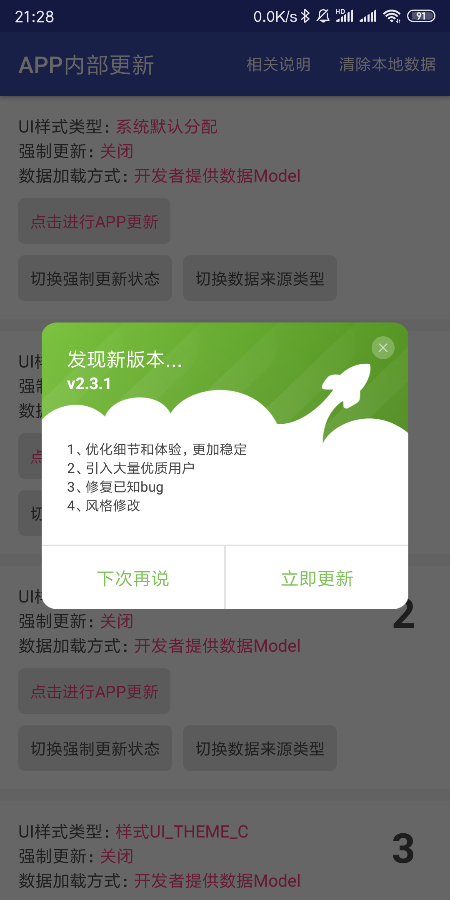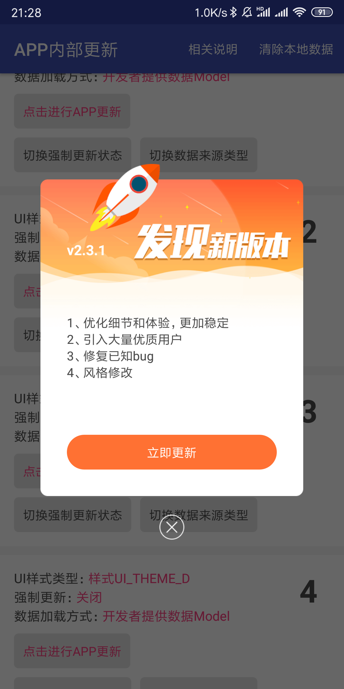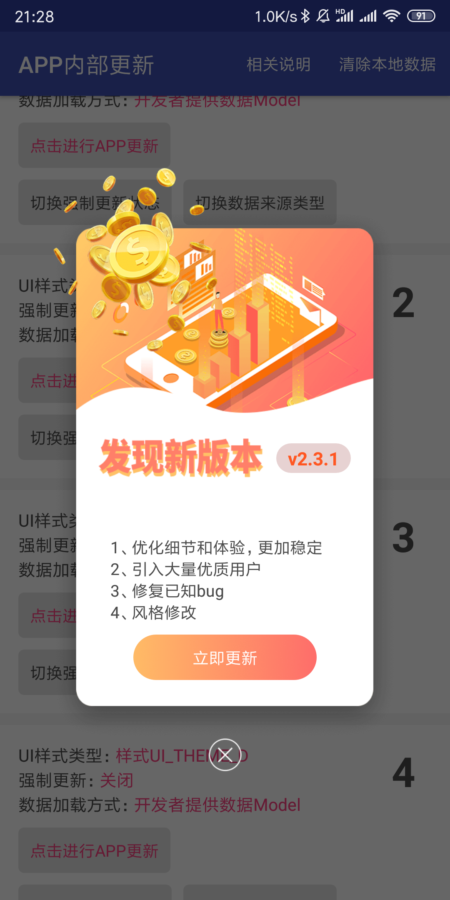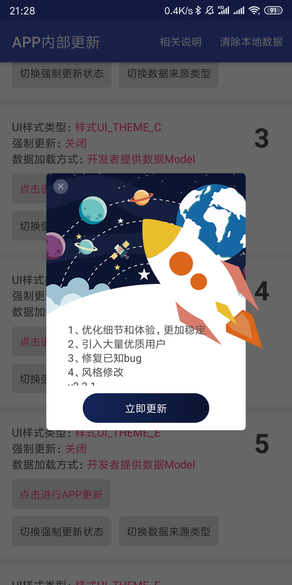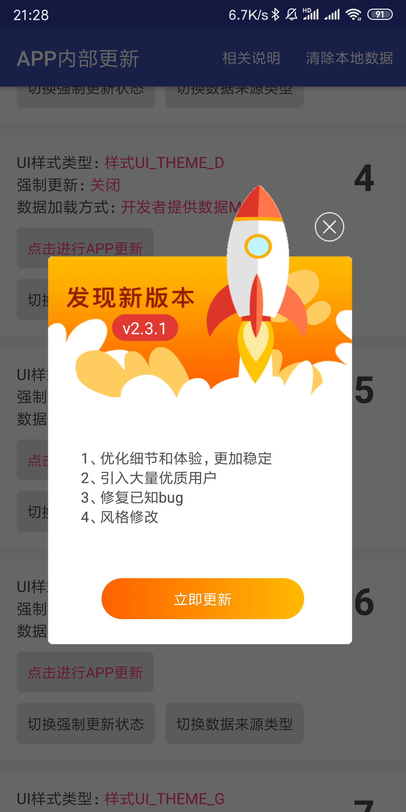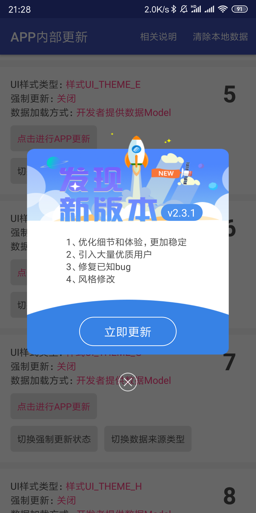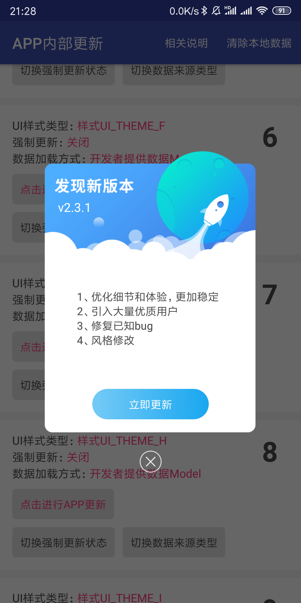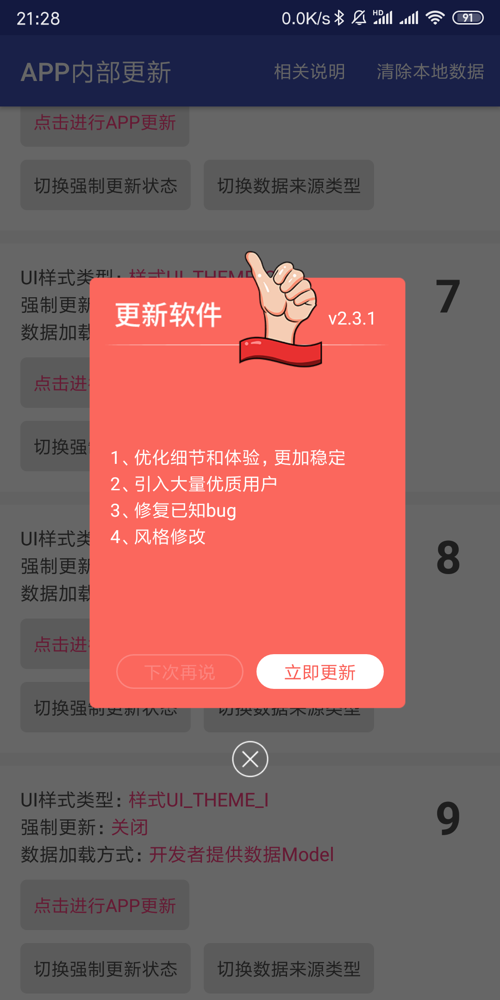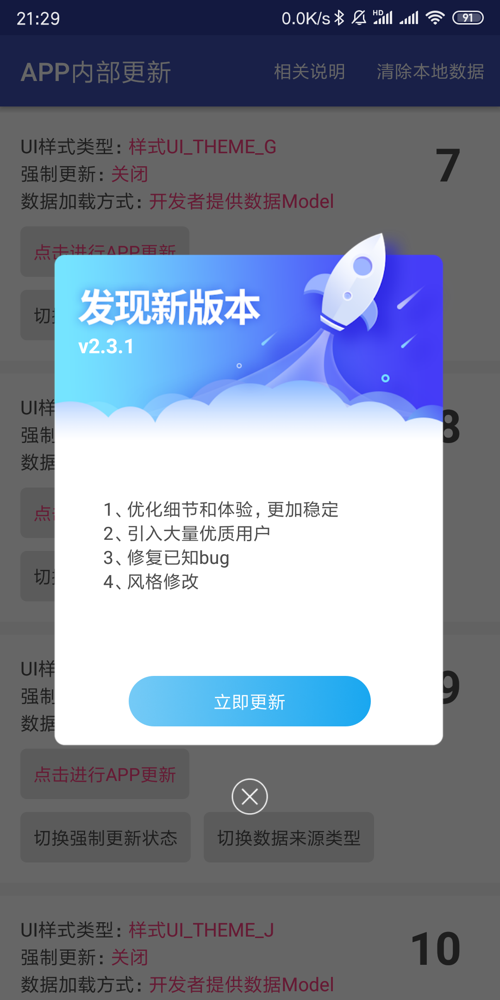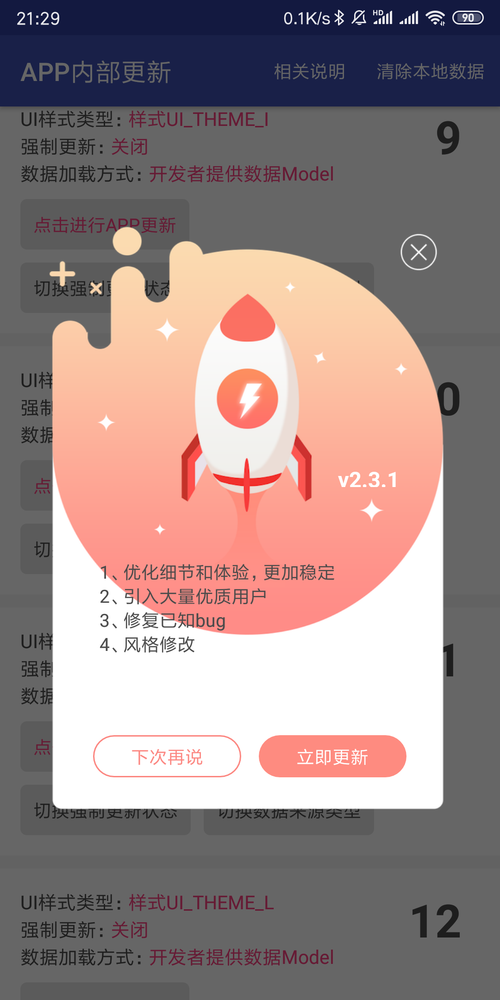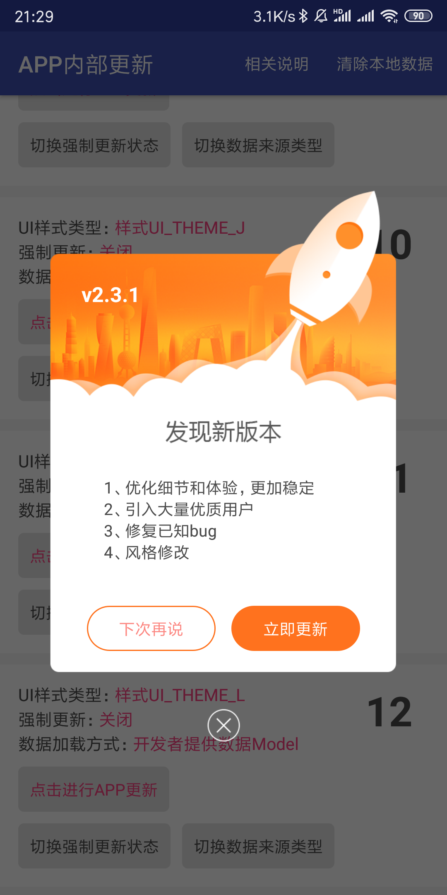</div>


### 使用方式

**Step 1.** Add the JitPack repository to your build file Add it in your root build.gradle at the end of repositories: 

```gradle
allprojects { repositories { ... maven { url 'https://jitpack.io' } } }
```

**Step 2.** Add the dependency
```gradle
    dependencies { implementation 'com.github.MZCretin:AutoUpdateProject:latest_version' }
```

**Step 3.** Init it in BaseApplication or MainActivity before using it.And then register BaseApplication in AndroidManifest(Don't forget it).

```java
        //如果你想使用okhttp作为下载的载体，那么你需要自己依赖okhttp，更新库不强制依赖okhttp！可以使用如下代码创建一个OkHttpClient 并在UpdateConfig中配置setCustomDownloadConnectionCreator start
        OkHttpClient.Builder builder = new OkHttpClient.Builder();
        builder.connectTimeout(30_000, TimeUnit.SECONDS)
                .readTimeout(30_000, TimeUnit.SECONDS)
                .writeTimeout(30_000, TimeUnit.SECONDS)
                //如果你需要信任所有的证书，可解决根证书不被信任导致无法下载的问题 start
                .sslSocketFactory(SSLUtils.createSSLSocketFactory())
                .hostnameVerifier(new SSLUtils.TrustAllHostnameVerifier())
                //如果你需要信任所有的证书，可解决根证书不被信任导致无法下载的问题 end
                .retryOnConnectionFailure(true);
        //如果你想使用okhttp作为下载的载体，那么你需要自己依赖okhttp，更新库不强制依赖okhttp！可以使用如下代码创建一个OkHttpClient 并在UpdateConfig中配置setCustomDownloadConnectionCreator end

        //当你希望自己提供json数据给插件，让插件自己解析并实现更新
        UpdateConfig updateConfig = new UpdateConfig()
                        .setDebug(true)//是否是Debug模式
                        .setDataSourceType(TypeConfig.DATA_SOURCE_TYPE_JSON)//设置获取更新信息的方式为JSON方式
                        .setShowNotification(true)//配置更新的过程中是否在通知栏显示进度
                        .setNotificationIconRes(R.mipmap.download_icon)//配置通知栏显示的图标
                        .setUiThemeType(TypeConfig.UI_THEME_AUTO)//配置UI的样式，一种有12种样式可供选择
                        .setAutoDownloadBackground(false)//是否需要后台静默下载，如果设置为true，则调用checkUpdate方法之后会直接下载安装，不会弹出更新页面。当你选择UI样式为TypeConfig.UI_THEME_CUSTOM，静默安装失效，您需要在自定义的Activity中自主实现静默下载，使用这种方式的时候建议setShowNotification(false)，这样基本上用户就会对下载无感知了
                        .setCustomActivityClass(CustomActivity.class)//如果你选择的UI样式为TypeConfig.UI_THEME_CUSTOM，那么你需要自定义一个Activity继承自RootActivity，并参照demo实现功能，在此处填写自定义Activity的class，否则不用设置
                        .setNeedFileMD5Check(false)//是否需要进行文件的MD5检验，如果开启需要提供文件本身正确的MD5校验码，DEMO中提供了获取文件MD5检验码的工具页面，也提供了加密工具类Md5Utils
                        .setCustomDownloadConnectionCreator(new OkHttp3Connection.Creator(builder))//如果你想使用okhttp作为下载的载体，可以使用如下代码创建一个OkHttpClient，并使用demo中提供的OkHttp3Connection构建一个ConnectionCreator传入，在这里可以配置信任所有的证书，可解决根证书不被信任导致无法下载apk的问题
                        .setModelClass(new UpdateModel());//这里设置JSON解析之后对应的Model 用于json解析
        AppUpdateUtils.init(this, updateConfig);//执行初始化

        //当你希望使用传入model的方式，让插件自己解析并实现更新
        UpdateConfig updateConfig = new UpdateConfig()
                .setDebug(true)//是否是Debug模式
                .setDataSourceType(TypeConfig.DATA_SOURCE_TYPE_MODEL)//设置获取更新信息的方式
                .setShowNotification(true)//配置更新的过程中是否在通知栏显示进度
                .setNotificationIconRes(R.mipmap.download_icon)//配置通知栏显示的图标
                .setUiThemeType(TypeConfig.UI_THEME_AUTO)//配置UI的样式，一种有12种样式可供选择
                .setAutoDownloadBackground(false)//是否需要后台静默下载，如果设置为true，则调用checkUpdate方法之后会直接下载安装，不会弹出更新页面。当你选择UI样式为TypeConfig.UI_THEME_CUSTOM，静默安装失效，您需要在自定义的Activity中自主实现静默下载，使用这种方式的时候建议setShowNotification(false)，这样基本上用户就会对下载无感知了
                .setCustomActivityClass(CustomActivity.class)//如果你选择的UI样式为TypeConfig.UI_THEME_CUSTOM，那么你需要自定义一个Activity继承自RootActivity，并参照demo实现功能，在此处填写自定义Activity的class
                .setNeedFileMD5Check(false)//是否需要进行文件的MD5检验，如果开启需要提供文件本身正确的MD5校验码，DEMO中提供了获取文件MD5检验码的工具页面，也提供了加密工具类Md5Utils
                .setCustomDownloadConnectionCreator(new OkHttp3Connection.Creator(builder));//如果你想使用okhttp作为下载的载体，可以使用如下代码创建一个OkHttpClient，并使用demo中提供的OkHttp3Connection构建一个ConnectionCreator传入，在这里可以配置信任所有的证书，可解决根证书不被信任导致无法下载apk的问题
        AppUpdateUtils.init(this, updateConfig);

        //当你希望使用配置请求链接的方式，让插件自己解析并实现更新
        UpdateConfig updateConfig = new UpdateConfig()
                .setDebug(true)//是否是Debug模式
                .setBaseUrl("http://www.cretinzp.com/system/versioninfo")//当dataSourceType为DATA_SOURCE_TYPE_URL时，配置此接口用于获取更新信息
                .setMethodType(TypeConfig.METHOD_GET)//当dataSourceType为DATA_SOURCE_TYPE_URL时，设置请求的方法
                .setDataSourceType(TypeConfig.DATA_SOURCE_TYPE_URL)//设置获取更新信息的方式
                .setShowNotification(true)//配置更新的过程中是否在通知栏显示进度
                .setNotificationIconRes(R.mipmap.download_icon)//配置通知栏显示的图标
                .setUiThemeType(TypeConfig.UI_THEME_AUTO)//配置UI的样式，一种有12种样式可供选择
                .setRequestHeaders(null)//当dataSourceType为DATA_SOURCE_TYPE_URL时，设置请求的请求头
                .setRequestParams(null)//当dataSourceType为DATA_SOURCE_TYPE_URL时，设置请求的请求参数
                .setAutoDownloadBackground(false)//是否需要后台静默下载，如果设置为true，则调用checkUpdate方法之后会直接下载安装，不会弹出更新页面。当你选择UI样式为TypeConfig.UI_THEME_CUSTOM，静默安装失效，您需要在自定义的Activity中自主实现静默下载，使用这种方式的时候建议setShowNotification(false)，这样基本上用户就会对下载无感知了
                .setCustomActivityClass(CustomActivity.class)//如果你选择的UI样式为TypeConfig.UI_THEME_CUSTOM，那么你需要自定义一个Activity继承自RootActivity，并参照demo实现功能，在此处填写自定义Activity的class
                .setNeedFileMD5Check(false)//是否需要进行文件的MD5检验，如果开启需要提供文件本身正确的MD5校验码，DEMO中提供了获取文件MD5检验码的工具页面，也提供了加密工具类Md5Utils
                .setCustomDownloadConnectionCreator(new OkHttp3Connection.Creator(builder))//如果你想使用okhttp作为下载的载体，可以使用如下代码创建一个OkHttpClient，并使用demo中提供的OkHttp3Connection构建一个ConnectionCreator传入，在这里可以配置信任所有的证书，可解决根证书不被信任导致无法下载apk的问题
                .setModelClass(new UpdateModel());
        AppUpdateUtils.init(this, updateConfig);

```

**Step 4.** Start using it wherever you want as below with 3 ways.

```java
    //有三种方式实现app更新，您可选其中一种方式来进行，推荐使用第三种方式！
    //新增下载进度和MD5检测结果的回调监听 2019-10-22 18:51:19

    //第一种方式，使用JSON字符串，让sdk自主解析并实现功能
    String jsonData = "{\"versionCode\": 25,\"isForceUpdate\": 1,\"preBaselineCode\": 24,\"versionName\": \"v2.3.1\",\"downurl\": \"http://jokesimg.cretinzp.com/apk/app-release_231_jiagu_sign.apk\",\"updateLog\": \"1、优化细节和体验，更加稳定\n2、引入大量优质用户\r\n3、修复已知bug\n4、风格修改\",\"size\": \"31338250\",\"hasAffectCodes\": \"1|2|3|4|5|6|7|8|9|10|11|12|13|14|15|16|17|18|19|20|21|22|23|24\"}";
    AppUpdateUtils.getInstance()
                        .addMd5CheckListener(...)//添加MD5检查更新
                        .addAppDownloadListener(...)//添加文件下载监听
                        .checkUpdate(jsonData);

    //第二种方式，使用MODEL方式，组装好对应的MODEL，传入sdk中
    DownloadInfo info = new DownloadInfo().setApkUrl("http://jokesimg.cretinzp.com/apk/app-release_231_jiagu_sign.apk")
            .setFileSize(31338250)
            .setProdVersionCode(25)
            .setProdVersionName("2.3.1")
            .setMd5Check("68919BF998C29DA3F5BD2C0346281AC0")
            .setForceUpdateFlag(listModel.isForceUpdate() ? 1 : 0)
            .setUpdateLog("1、优化细节和体验，更加稳定\n2、引入大量优质用户\r\n3、修复已知bug\n4、风格修改");
    AppUpdateUtils.getInstance()
                        .addMd5CheckListener(...)//添加MD5检查更新
                        .addAppDownloadListener(...)//添加文件下载监听
                        .checkUpdate(info);

    //第三种方式，在初始化的时候配置接口地址，sdk自主请求+解析实现功能（推荐）
    AppUpdateUtils.getInstance()
                        .addMd5CheckListener(...)//添加MD5检查更新
                        .addAppDownloadListener(...)//添加文件下载监听
                        .checkUpdate();

```

### 使用注意点

+ 最简单快捷的方式就是使用传入MODEL的形式，因为这种方式需要的配置最少，但是你需要自己处理请求，并保证最终调用checkUpdate(model)的时候是在主线程。
+ 在使用传入json这种方式的时候，你需要同样保证调用checkUpdate(json)的时候在主线程，并且你需要在初始化的时候配置json对应的model【setModelClass(new UpdateModel())】，并保证这个model实现了LibraryUpdateEntity接口。
+ 在使用配置接口地址的方式的时候，您需要设置一个请求链接地址！当然，如果是需要的话，您需要设置请求方式，设置请求头和请求参数；并且你需要在初始化的时候配置请求成功之后返回的数据所对应的model【setModelClass(new UpdateModel())】，并保证这个model实现了LibraryUpdateEntity接口。
+ 如果你需要自定义UI，请自定义一个普通的Activity就可以了，这个Activity需要继承RootActivity，这样你就拥有了自动更新的能力；另外建议给这个自定义的Activity添加一个主题@style/DialogActivityTheme，这样他就能以对话框的形式展示，据我们的UI说这样会好看点。

#### 有什么意见或者建议欢迎与我交流，觉得不错欢迎Star

使用过程中如果有什么问题或者建议，欢迎在issue中提出来或者直接联系我 mxnzp_life@163.com 嘿嘿！


